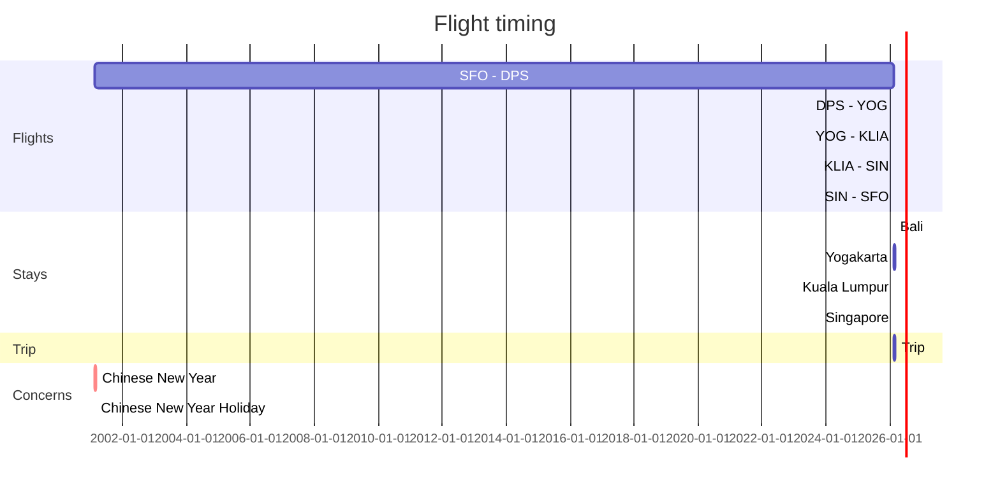

# Trip to SE Asia
**February-March 2018**

  <!-- - Fly SFO - KLIA ( / )
Kuala Lumpur
  - Fly KLIA - DPS ( $40 )
  - Fly KLIA - YOG ( $60 )
Indonesia
  - Fly within ( $35 )
  - Fly DPS - SIN ( $50 )
  - Fly YOG - SIN ( $100 )
Singapore
  - Fly SIN - SFO ( / )

  - Fly SFO - KLIA ( +$100 )
Bali
  - Fly DPS - KLIA ()
Kuala Lumpur
  - Fly KLIA - KLIA ()
Singapore -->

### Rules
1. Singapore needs to be last (CNY)
2. Don't take train or bus

### Plan 1

\$145
### Plan 2
#### 2a

\$210 / \$230
#### 2b

\$205
